<h1>Magic Balon Decor</h1>

Magic Balon Decor is a company that mainly decorates for all kinds of occasions, they also sell all kinds of balloons and decoration. This site targets new but also regular costumers. It provides information about the company, lets the costumers see what the company is capable of and gives the option for the client to fill in a form and schedule the company for decoration. Now all the costumers call the company so the use of this site could help them win time by not being on the phone as much.

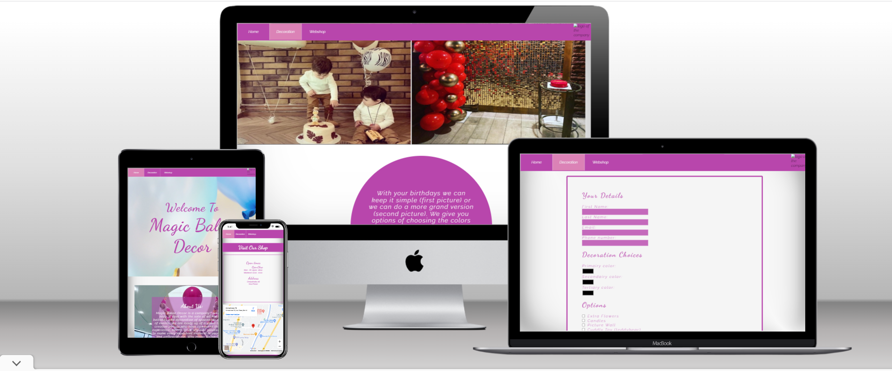

 

<h1>features</h1>
<ul>
<li><h2>navbar</h2></li>
    <ul>
    <li>Contains links to the Home, Webshop and the Decoration pages and will be responsive on all devices.</li>
    <li> When the user hovers over "Decoration" on the navbar the links to the Birthday, Engagment, Gender reveal, Grand opening
    and Wedding pages will be shown. We didn't learn this yet so i used this site to help me make this feature https://www.w3docs.com/snippets/css/how-to-create-a-drop-down-navigation-menu-with-css.html</li>
    <li>The navbar is fixed so that the user doesn't need to scroll up when wanting to go to another page.</li>
    <li>This section will allow the user to easily navigate from page to page across all devices without having to revert back to the previous page via the ‘back’ button.</li>
    </ul>
</ul>

<ul>
<li><h2>The landing page image</h2></li>
    <ul>
    <li>This section provides a big image of balloons with a text overlay of "welcome to magic balon decor" to catch the eye of the costumer.</li>
    </ul>
</ul>

<ul>
<li><h2>The about us section</h2></li>
    <ul>
    <li>The about us section has a background of some decoration the company has done for a mall. The picture is to show especially new costumers that the company is creative and some things they are capable of.</li>
    <li>Text overlay over the picture tells again especially new costumers about the company and why you should choose it to decorate a special occasion.</li>
    </ul>
</ul>

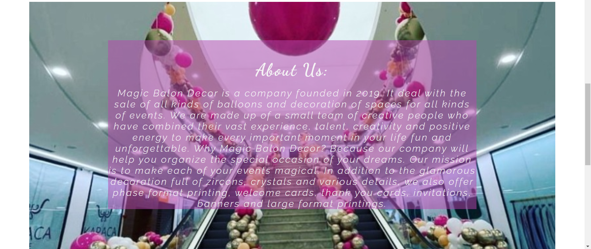

<ul>
<li><h2>The visit our shop section</h2></li>
    <ul>
    <li> On the left side of this section you can find the open times and the address of the company.</li>
    <li> On the right side of this section there is a google maps map with the location of the shop with an option to plan a route to the location.
    </li>
    </ul>
</ul>

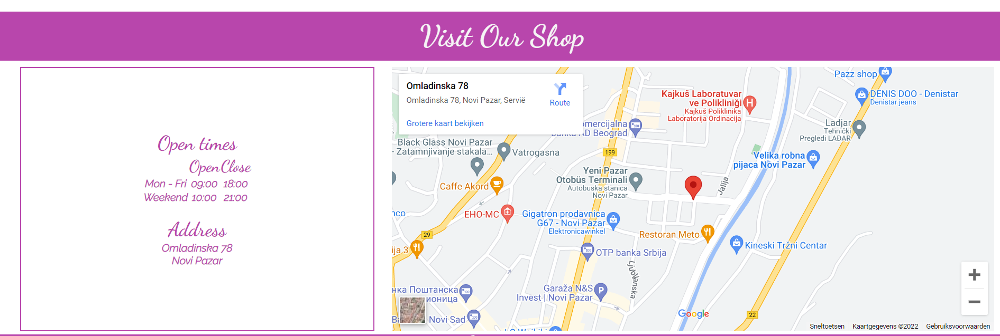

<ul>
<li><h2>The Birthday, Engangment, Gender Reveal and Grand Opening pages</h2></li>
    <ul>
    <li>All the pages have the same lay-out and structure only the content is different.</li>
</ul>
<ul>
    <li><h2>Picture example section</h2></li>
    <ul>
    <li>This section shows the name of the page your on and 2 pictures of examples with regards to the page the user is on.</li>
    <li>The first picture doesn't have many options and is a more basic version and the second picture has more options. This is also that the user can see a difference and what they would like more.</li>
    </ul>
</ul>
    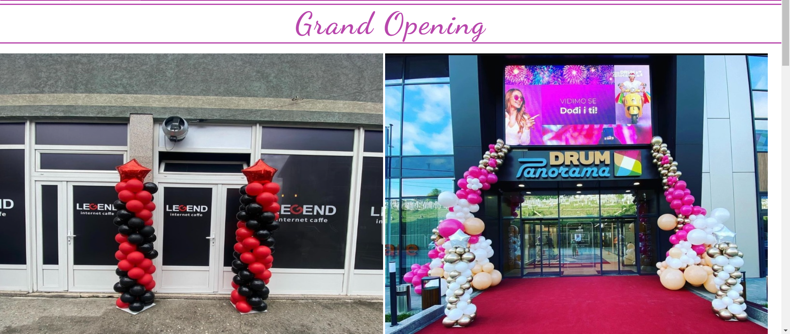

<ul>
    <li><h2>Decoration info section</h2></li>
    <ul><li>This section tells about the pictures above and gives the user some more information.</li>
    </ul>
</ul>
    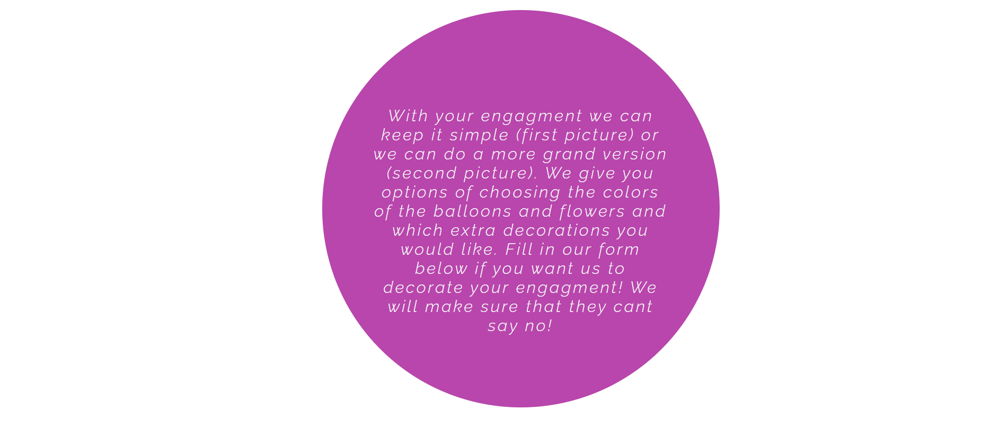
<ul>
    <li><h2>Form</h2></li>
    <ul>
    <li>The form has a your details section where the user needs to fill in their first and last name, email and phone number. these are required.</li>
    <li>The decoration and options section lets the user choose 3 colors they want and extra options thru checkboxen it also has a textarea if the user want something specific.</li>
    <li>Lastly the form has a date and time the user needs to fill out when they want the decoration. these are also required.</li>
    </ul>
</ul>
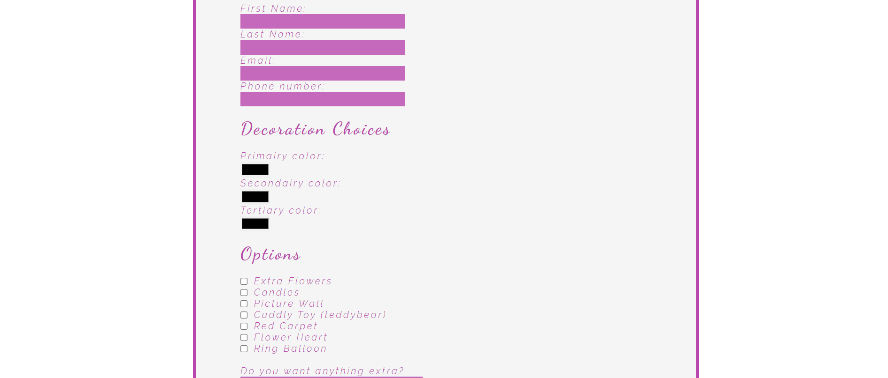
</ul>

<ul>
<li><h2>Wedding page</h2></li>
    <ul>
    <li>Just like the other pages in the decoration section This section shows the name of the page your on and 2 pictures of examples with regards to the page the user is on.</li>
    <li>It also gives some information that the user should call the company because with weddings they want to make it as specifik as possible.</li>
    </ul>
</ul>

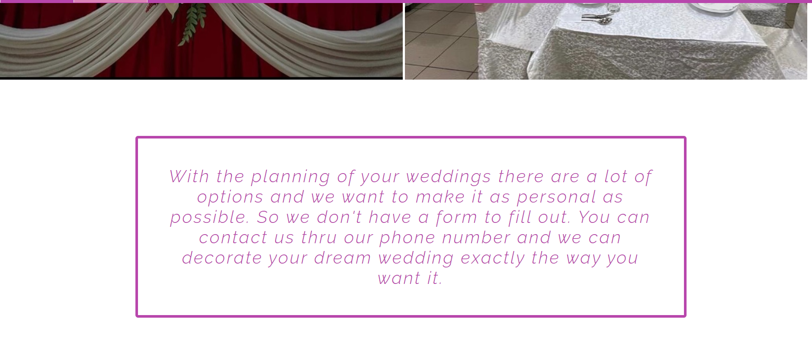

<ul>
<li><h2>Webshop page</h2></li>
    <ul>
    <li> The webshop page for now just says there will be a webshop in the future. The company wants and needs a webshop so i already put it in the navbar.</li>
    </ul>
</ul>

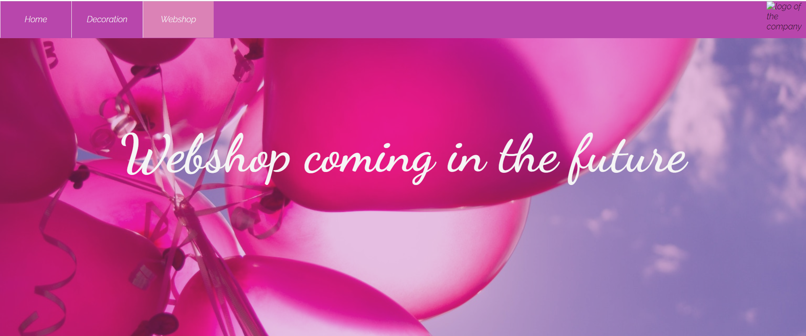

<ul>
<li><h2>contact.html file</h2></li>
    <ul>
    <li>When the user fills in the form they are sent to this page. Because of the lack of javascript this was the selution to make it look like the users form is send.</li>
    <li>It informs the user that this is just for show and if they want they should contact the company thru instagram (link in the footer). The user can go back to the homepage thru the button.
    </li>
    </ul>
</ul>

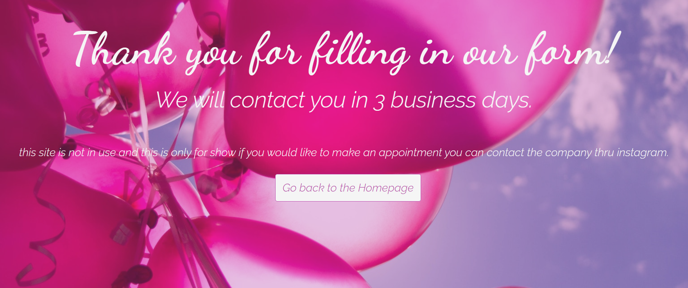

<h2>Features left to implement</h2>
<ul>
<li>The webshop page</li>
<li>The form and contact.html page that it actually works and pushes the information</li>
</ul>

 

<h1>Testing</h1>

<h2>Responsiveness</h2>

All pages were tested to ensure responsiveness on screen sizes from 320px and upwards.

Steps to test:

<ol>
<li>Open browser and navigate to <a href="https://huremovic95.github.io/magic-balon-decor/index.html" target="_blank">magic balon decor</a></li>
<li>Open the developer tools (right click and inspect)
</li>
<li>Set to responsive and decrease width to 320px</li>
<li>Set the zoom to 50%</li>
<li>Click and drag the responsive window to maximum width
</li>
</ol>

 

Expected:

Website is responsive on all screen sizes and no images are pixelated or stretched. No horizontal scroll is present. No elements overlap.

Actual: website behaves as expected except for the decoration-info section in the decoration files. It feels out of place some of the time but on phone, tablet and desktop screens its fine.

Website was also opened on the following devices and no responsive issues were seen:

<ul>
<li>Iphone 12</li>
<li>Ipad air</li>
</ul>

<h2>Lighthouse testing</h2>

index page
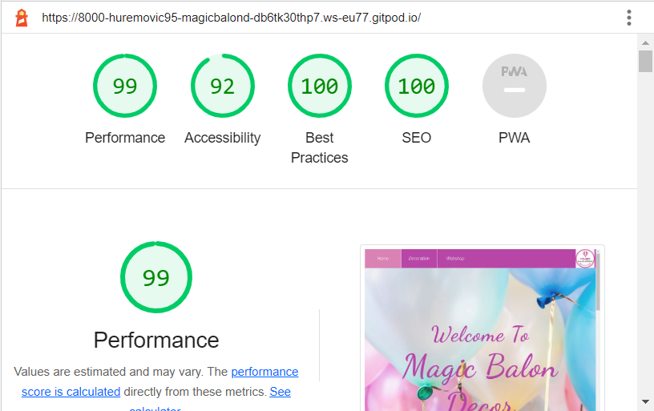
decoration pages
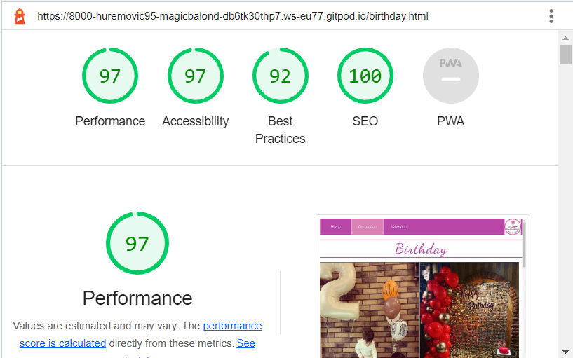
webshop page
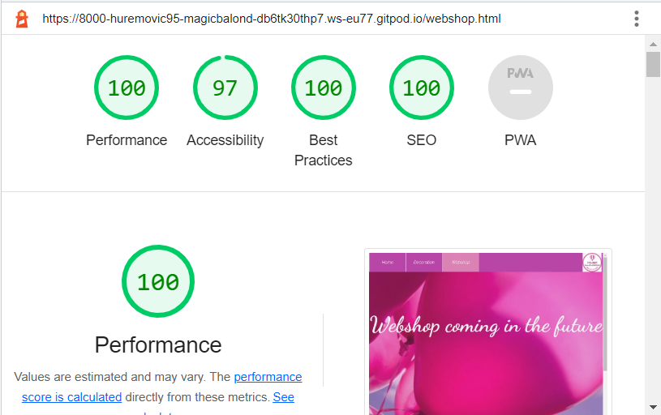
contact page
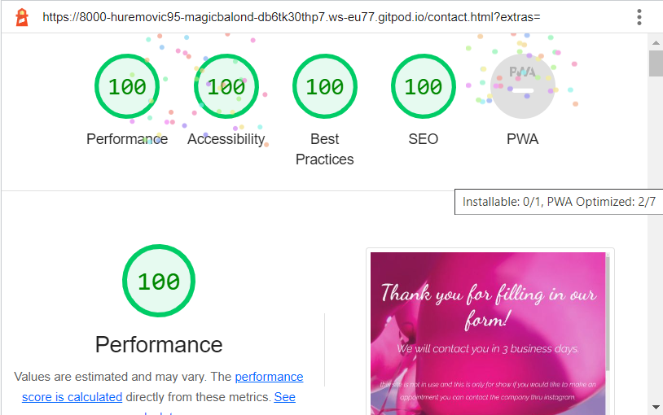

 

<h2>Validator testing</h2>

<!--  <ul>
<li>HTML</li>
<ul><li>No errors were found when passing through the official <a href="https://jigsaw.w3.org/css-validator/" target="_blank">W3C validator</a></li>
</ul>
</ul> -->

<ul>
<li>CSS</li>
<ul><li>No errors were found when passing through the official <a href="https://jigsaw.w3.org/css-validator/" target="_blank">(Jigsaw) validator</a></li>
</ul>
</ul>

<h2>Functional testing</h2>

<h3>Navigation links</h3>
<table>
<tr><th>Navigation links</th><th>Page to load</th></tr>
<tr><td>Home</td><td>index.html</td></tr>
<tr><td>Birthday</td><td>birthday.html</td></tr>
<tr><td>Engagment</td><td>engagment.html</td></tr>
<tr><td>Gender reveal</td><td>gender-reveal.html</td>
</tr>
<tr><td>Grand opening</td><td>grand-opening.html</td>
</tr>
<tr><td>Wedding</td><td>wedding.html</td></tr>
<tr><td>Webshop</td><td>webshop.html</td></tr>
</table>

<h3>Form testing</h3>

The form on all pages is almost the same so testing the form on one page is sufficient.

The form on the birthday page was tested to ensure it functioned as expected when correct data was input and when incorrect data was input. The following test scenarios were covered:

<em>Correct inputs</em>

steps to test:

<ol><li>Navigate to <a href="https://huremovic95.github.io/magic-balon-decor/birthday.html">Magic Balon Decor - Birthday page</a></li>
<li>Scroll down to the form and input the following data:</li><ul>
<li>First Name: Obi</li>
<li>Last Name: Kenobi</li>
<li>Email: obi-one@jedi.com</li>
<li>Number: 0612345687</li>
<li>Date: 07-12-2022</li>
<li>Time: 21:00</li>
</ul>
<li>Click Make Appointment</li>
<li>User should be redirected to contact.html confirmation page</li>
</ol>

Expected:

Form submits with no warnings or errors and user is redirected to contact.html page.

Actual:

Website behaved as expected with no errors or warnings and redirected to contact.html.

<h2>Unfixed bugs</h2>

In the hosted website the logo of the company on the navbar is not visible but when serving it (python3 -m http.server) the logo is visible.
